# Actividad 5-Programacion Web
# Proyecto: Login
**Integrantes **
- Pliego Méndez Alondra 

- Salinas Cenobio Leonel Isaac

## Explicación y documentación
Los frameworks usados provienen de la siguiente página; **[Material Design for Bootstrap versión 5](https://mdbootstrap.com/docs/standard/extended/login/)**, además de la incorporación del [cdn](https://cdn.jsdelivr.net/gh/leosc91/Componente-Menu@main/css/componente.css) proveniente de la [librería propia](https://github.com/leosc91/Componente-Menu) para la incorporación del componente visual Menú Dropdown, así como la incorporación del [cdn JS](https://cdn.jsdelivr.net/npm/componente-carrusel-pwa@1.0.1/dist/carrusel.js) y [cdn CSS](https://cdn.jsdelivr.net/npm/componente-carrusel-pwa@1.0.1/dist/carrusel.css) creación de la colaboradora para la incorporación del componente visual Carrusel.
El flujo inicia en el login, al confirmar a través del mismo las credenciales (correo y contraseña), pasa al index (pantalla del sistema), en el cual se encuentran las funcionalidades requeridas. El nombre del usuario, en este caso su correo electrónico pasa al navbar gracias a los siguientes métodos:
- sessionStorage es un objeto que almacena los datos de sesión
```javascript
sessionStorage.setItem("correoIngresado", correo);
```
- A través del método getItem obtenemos el valor guardado en la sessionStorage
```javascript
let correoGuardado = sessionStorage.getItem("correoIngresado");
```
## Metodos principales

| Método | ¿Qué hace? |
|---|---|
| `validarCorreo()` | A través de una expresión regular se encarga de validar los caracteres que pueden existir en un correo electrónico. |
| `validarPassword()` | Maneja una validación de mínimo 8 caracteres, un carácter en mayúscula, minúscula, uno especial y números. |
| `guardarDatos()` | Función que se encarga de almacenar la información obtenida del formulario de estudiantes para mostrarla en el modal. |
| `validarLongitud(numero, maxLongitud)` | Encargada de que solo se acepten sí o sí 6 números como número de control. |
| `esMayorDeEdad(fechaNacimiento)` | Manda a llamar una función que calcula la edad de la persona en base a su año de nacimiento y hace una simple comparación para determinar si es o no mayor de edad. |
| `soloNumeros(texto)` | No acepta más nada que números. |
## Proceso de creación
### Login
1. Para la construcción del login consideramos un plantilla de bootstrap para facilitarnos la parte de la creación de secciones, además de implementar estilos propios del framework. 
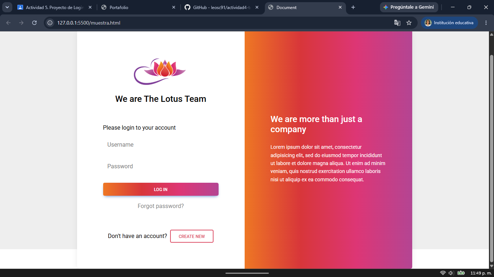
2. Eliminamos elementos innecesarios como la imagen de logo, la funcion de si olvidaste la contraseña o si no tenias una cuenta registrate, además de cambiar los colores.
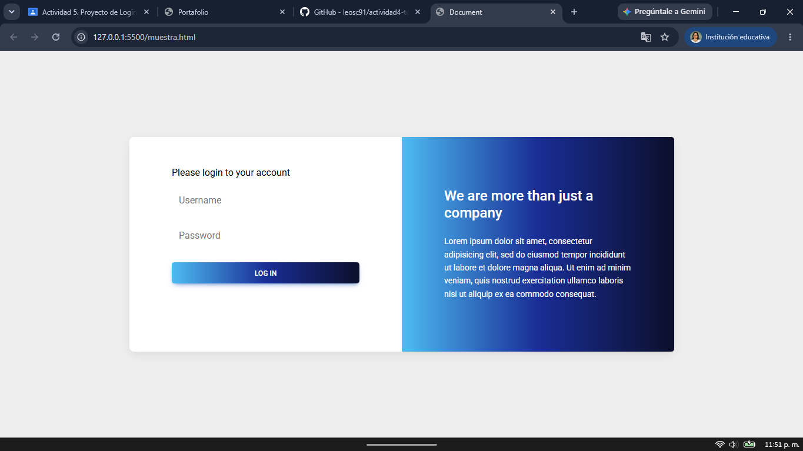
3. Teniendo lista la estructura básica optamos por añadir uno de los componentes creados en la actividad pasada, el componente visual de carrusel el cual fue implementado a través de un link de CDN.
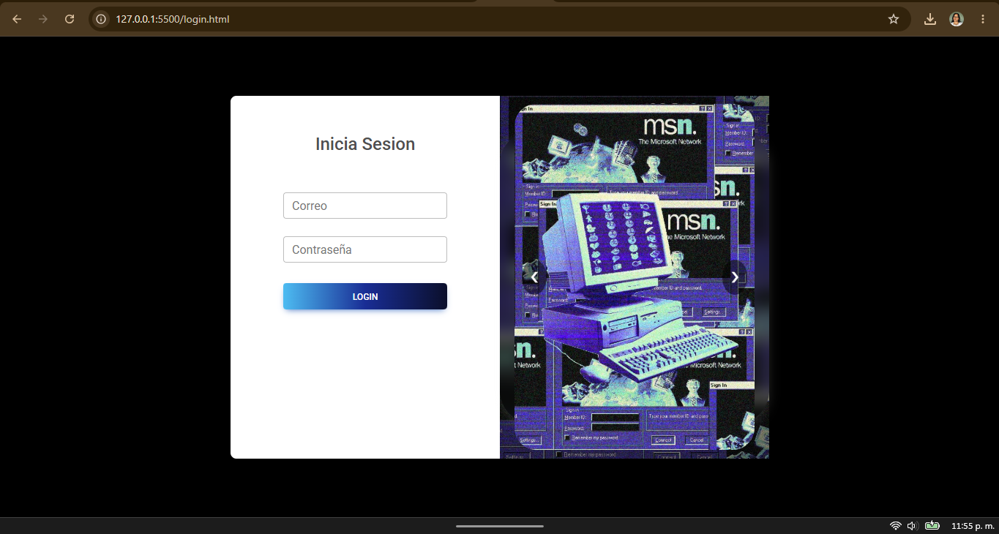
4. Por último se implementaron las funciones ya creadas con anterioridad sobre la validación de el correo electrónico y contraseña. Además de utilizar el objeto de *sessionStorage* para guardar los datos de inicio de sesion, en este caso el del usuario(correo).
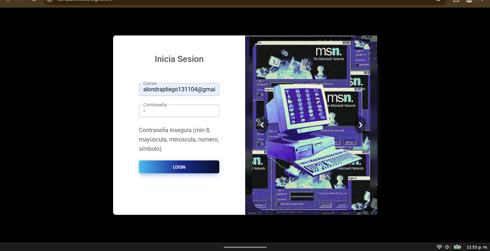
### Sidebar
El recurso visual Sidebar se implementó nativamente con el uso de la estructura **div**, la cual contiene **header, label, input** y **button** 
```html
    <div id="sidebar" class="sidebar">
        <h3>Menú Usuarios</h3>
        <h4>Captura</h4>
        
        <form id="formulario-captura">
            <label for="nombre">Nombre de usuario:</label>
            <input type="text" id="nombre" required>

            <label for="correo">Correo electrónico:</label>
            <input type="email" id="correo" required>

            <label for="password">Contraseña:</label>
            <input type="password" id="password" required>

            <button type="submit" class="boton-validar">Validar Datos</button>
        </form>
        
        <p id="mensaje-validacion"></p>
    </div>
```
para que la identidad visual de la página mantuviera integra se implementó por medio del lenguaje de diseño **CSS**.


### Navbar
Para la implementación de componente visual Navbar, como se mencionó con anterioridad se implemento una librería propia por medio de un recurso cdn la cual se puede obtener [aquí](https://cdn.jsdelivr.net/gh/leosc91/Componente-Menu@main/css/componente.css).
<div align="center">

</div>

### Formulario del estudiante
1. Tomamos como base un formulario creado con anterioridad a lo largo de las clases.
2. Establecemos los datos que queremos recibir y en base a eso, colocamos ciertas restricciones en los inputs.
```html
<form id="formDatos">
            <div class="campo">
                <label for="nombre">Número de control:</label>
                <input type="text" id="nc" maxlength="6" placeholder="221614" required>
            </div>
            <p class="error" id="errorNumeroControl"></p>

            <div class="campo">
                <label for="semestre">Último semestre cursado:</label>
                <input type="number" min="1" id="semestre" placeholder="Ej: 1" required>
            </div>
            <p class="error" id="errorSemestre"></p>

            <div class="campo">
                <label for="fechaNacimiento">Fecha de nacimiento:</label>
                <input type="date" id="fechaNacimiento" required>
            </div>
            <p class="error" id="errorFecha"></p>

            <button type="button" onclick="guardarDatos()">Guardar</button>
        </form>
```
3. Modificamos un poco el diseño para que encaje de acuerdo a la temática cyberpunk que decidimos seguir.
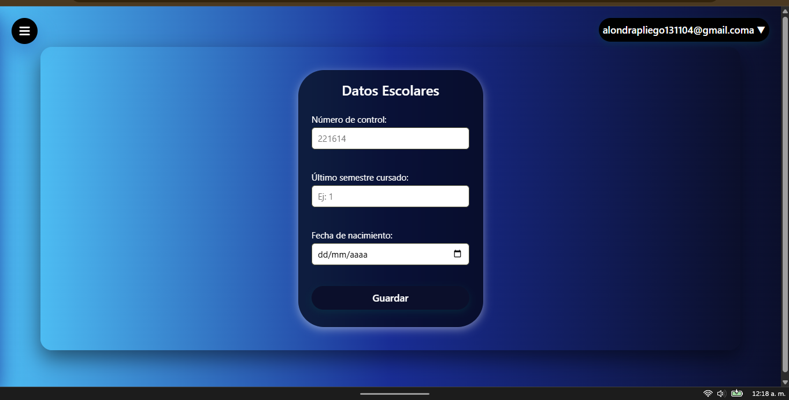
4. Enseguida aplicamos los métodos creados con anterioridad en **index.js** y corroboramos su adecuado funcionamiento.
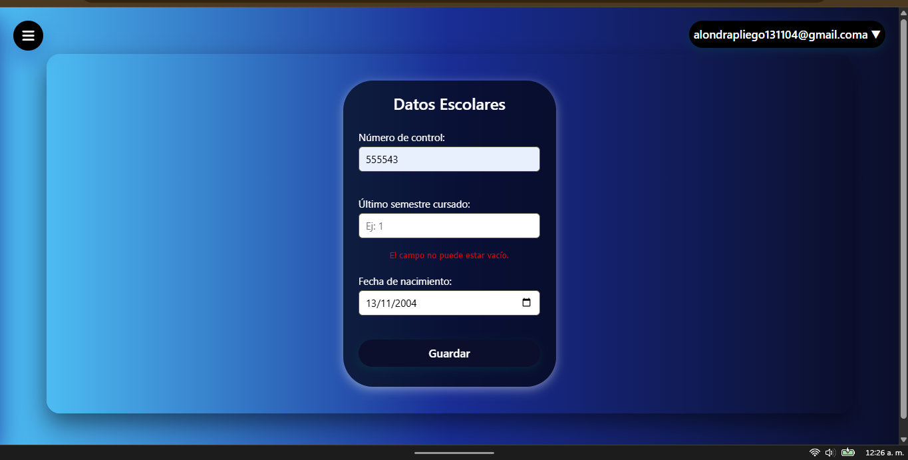
### Modal
1. Se crea un modal que mostrara los datos guardados del formulario del estudiante, considerando como prioridad que nos diga si este es mayor de edad o no.
2. Es un diseño sencillo de una tarjeta de información con un boton para cerrarlo.
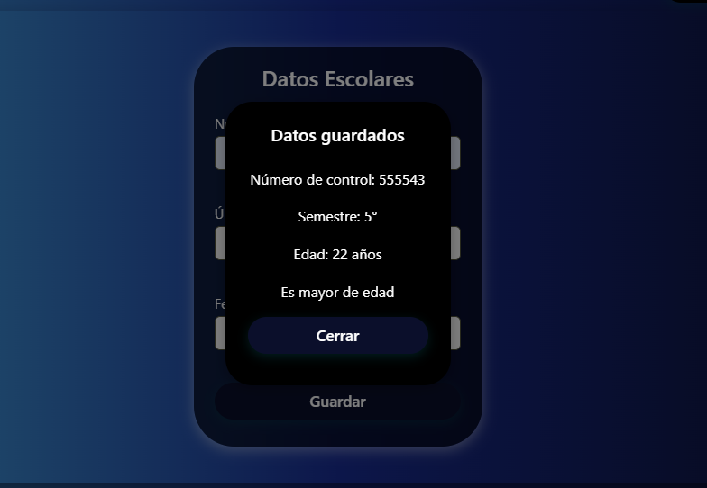

### Flujo
1. Ingreso de datos para iniciar sesión.
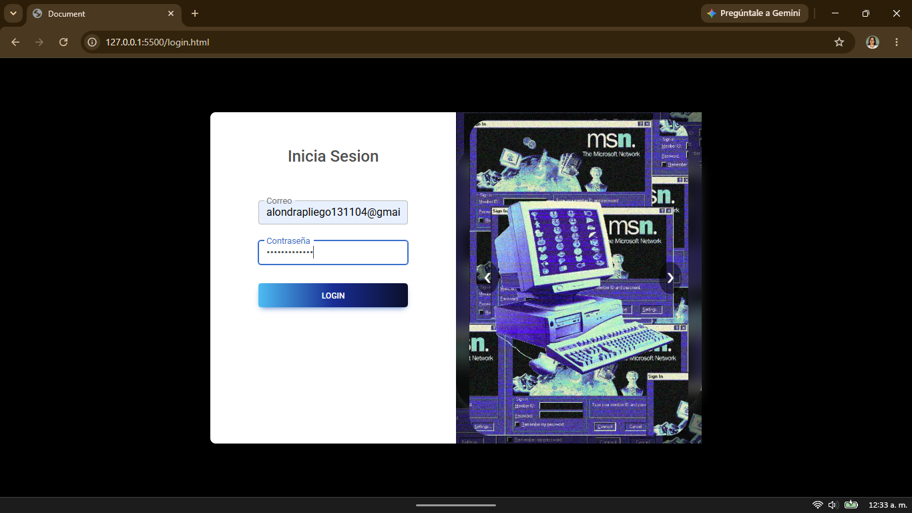
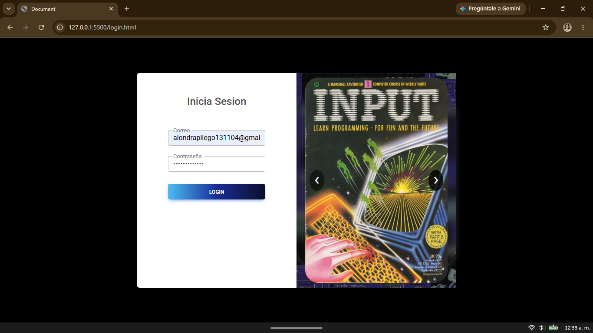
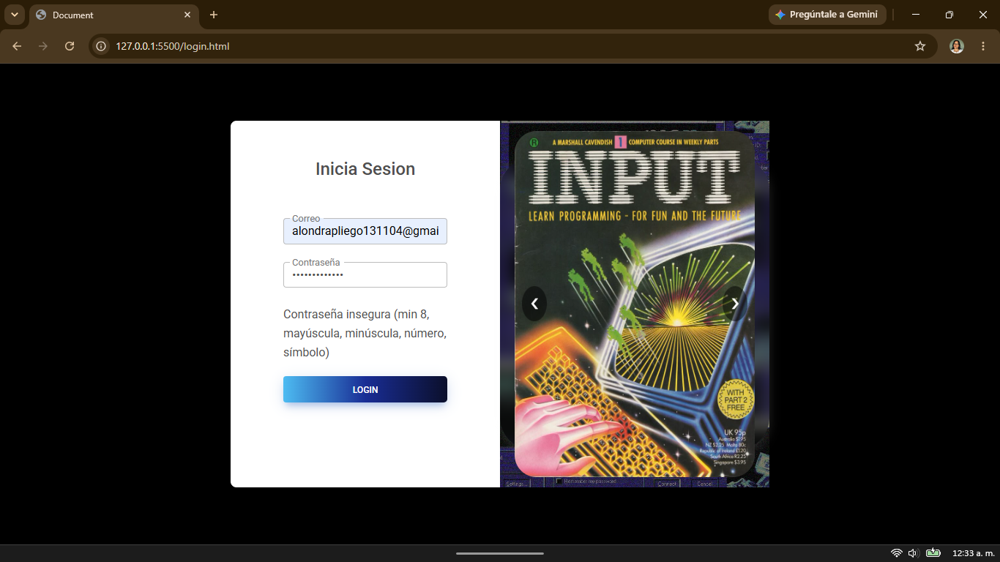
2. Verificamos que en el navBar aparezca el usuario (correo electronico)

3. Abrimos el menú para designar un nombre de usuario y corroborar correo electrónico y contraseña.
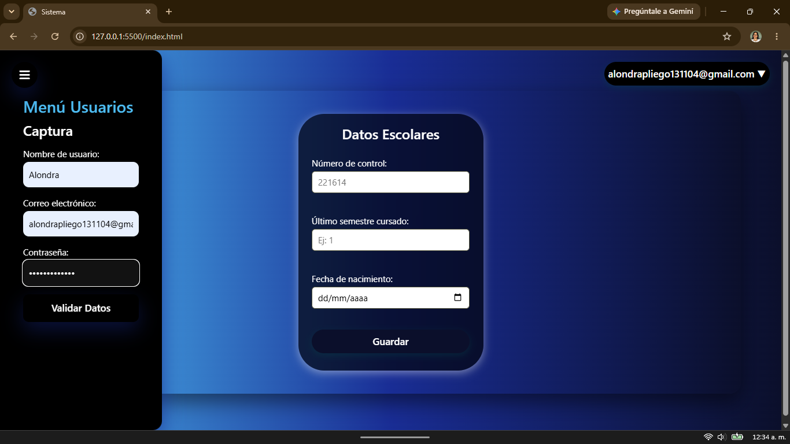
4. Enseguida respondemos el formulario de estudiante, lo validamos y esperamos la respuesta de nuestra información gracias al modal.
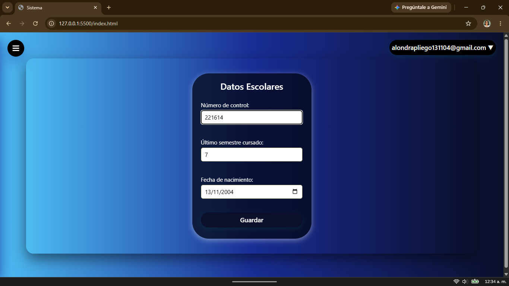
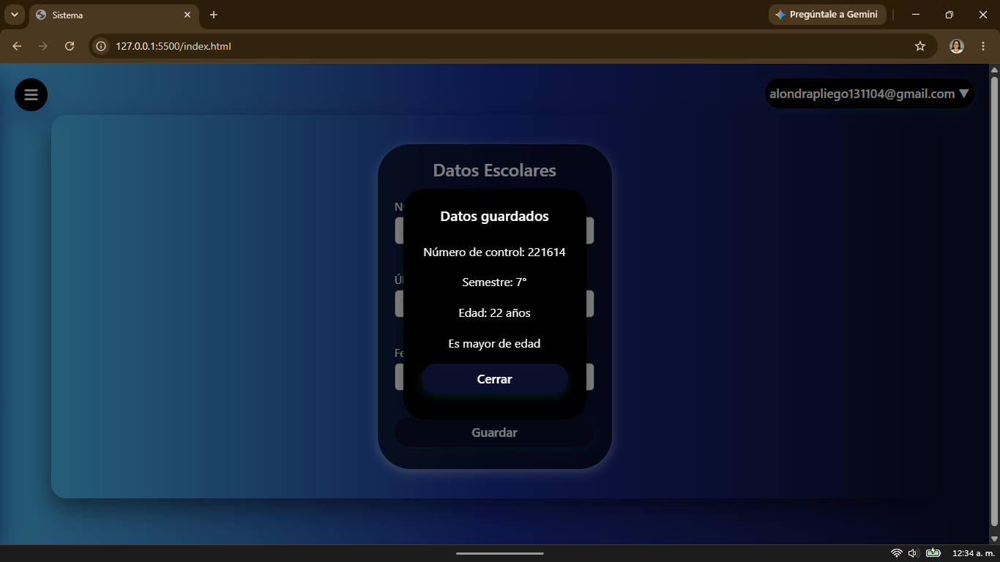
5. Cerramos sesión
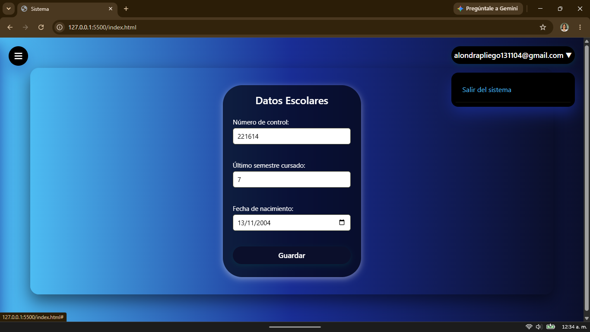
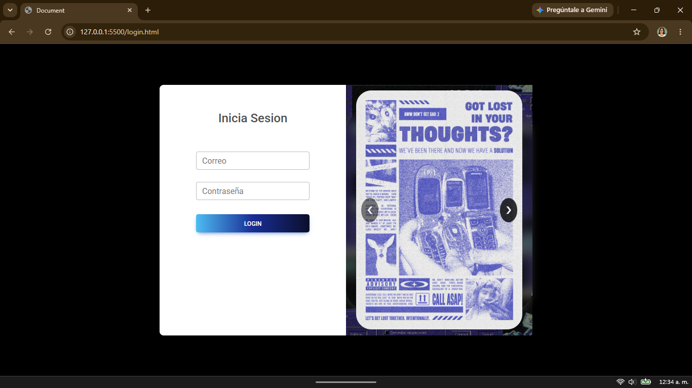
